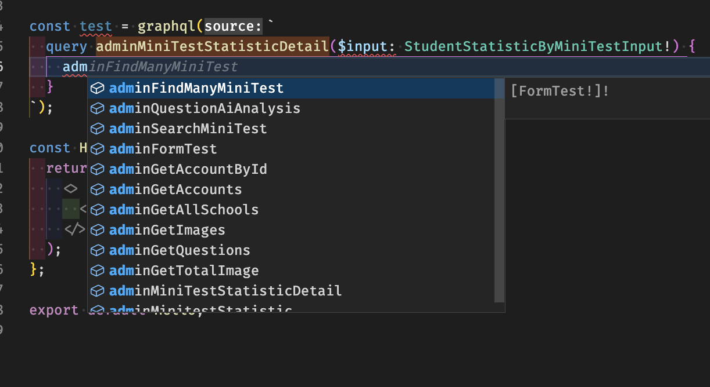

# Reactjs Graphql Autogen types

# Setup

```
npm i graphql

npm i @graphql-codegen/cli @graphql-codegen/client-preset --save-dev

npx graphql-codegen init

config codegen.ts

create folder src/gql

npm run codegen


Insalll extensions vscode: https://marketplace.visualstudio.com/items?itemName=GraphQL.vscode-graphql

create grapql.config.yml
```

## Result


